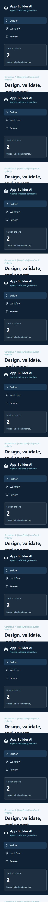
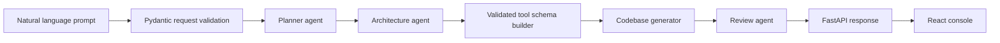

# App-Builder AI

Generative AI | Agentic AI | LangChain | LangGraph | Pydantic

App-Builder AI converts natural language product prompts into structured codebases using validated tool schemas and a multi-step agent workflow. It ships with a FastAPI backend, a React operator console, deterministic offline generation, and optional LangChain/OpenAI integration for richer planning.

## Screenshot



## What It Builds

- Project blueprint with product summary, stack choices, and implementation phases
- Validated file operation plan using Pydantic tool schemas
- Generated codebase manifest with frontend, backend, tests, docs, and environment files
- Review checklist and confidence scoring
- Project history through an in-memory repository adapter

## Architecture



The backend uses LangGraph when installed. If LangGraph is unavailable, the same nodes run through a deterministic sequential executor, so demos and tests work without network access or API keys.

## Quick Start

### Backend

```bash
cd app-builder-ai/backend
python -m venv .venv
.venv\Scripts\activate
pip install -e ".[dev]"
uvicorn app_builder_ai.main:app --reload --port 8100
```

Optional LLM mode:

```bash
set OPENAI_API_KEY=your_key
set APP_BUILDER_LLM_MODEL=gpt-4o-mini
```

### Frontend

```bash
cd app-builder-ai/frontend
npm install
npm run dev
```

Open the frontend at `http://localhost:5173`. It expects the API at `http://localhost:8100`.

## Deploy From GitHub

The project is ready for Git-based deployment:

- Deploy `frontend/` to Vercel.
- Deploy `backend/` to Render.
- Set `VITE_API_BASE_URL` in Vercel to your Render backend URL.

Full steps are in [DEPLOYMENT.md](DEPLOYMENT.md).

## API

Generate a project:

```bash
curl -X POST http://localhost:8100/api/projects/generate ^
  -H "Content-Type: application/json" ^
  -d "{\"prompt\":\"Build a SaaS CRM with auth, dashboard, billing, and analytics\",\"target_stack\":\"react-fastapi\",\"include_tests\":true}"
```

Health check:

```bash
curl http://localhost:8100/health
```

## Project Layout

```text
app-builder-ai/
  backend/
    app_builder_ai/
      agents/          LangGraph workflow and generation nodes
      api/             FastAPI routes
      core/            settings and app config
      schemas/         Pydantic request, response, and tool contracts
      services/        project repository and LLM planner adapter
    tests/
  frontend/
    src/
      components/
      lib/
```

## Example Prompt

```text
Create a multi-tenant project management app with teams, tasks, kanban boards,
role-based access, comments, notifications, analytics, and API documentation.
Use React for the frontend and FastAPI for the backend.
```

## Notes

This project is production-oriented scaffolding: persistence is intentionally in-memory for easy evaluation, and the generation engine emits structured manifests rather than writing arbitrary files to disk. That keeps the tool boundary explicit and safe while still showing how agentic codebase generation works end to end.
